# CipherSQLStudio Data-Flow Diagram

> **Important Note for Submission:** The project requirements state that the Data-Flow Diagram **must be drawn by hand** to prove understanding. You should use the text-based architecture mapping below as a reference to write out your physical diagram on paper before snapping a photo of it.

## The Query Execution Flow

Below is the step-by-step data flow from the moment a user clicks "Execute Query" to when the results appear on their screen.

```mermaid
sequenceDiagram
    participant User
    participant Frontend
    participant API
    participant MongoDB
    participant PostgreSQL
    
    User->>Frontend: Clicks "Run Query" (e.g. SELECT * FROM users)
    
    rect rgb(30, 41, 59)
    note right of Frontend: 1. Frontend Validation
    Frontend->>Frontend: Validate editor is not empty
    Frontend->>Frontend: Set executing = true (shows spinner)
    end
    
    Frontend->>API: POST /api/query { assignmentId, query, userId }
    
    rect rgb(30, 41, 59)
    note right of API: 2. Backend Validation & Prep
    API->>API: isSelectOnly(query) Regex Security Check
    API->>MongoDB: findById(assignmentId)
    MongoDB-->>API: Returns assignment (tables & schemas)
    end
    
    rect rgb(30, 41, 59)
    note right of API: 3. Sandbox Validation
    API->>PostgreSQL: Check if schema exists for assignment
    alt Schema missing
        API->>PostgreSQL: CREATE SCHEMA schema_id
        API->>PostgreSQL: Execute schema_sql & seed_sql
    end
    end
    
    rect rgb(30, 41, 59)
    note right of API: 4. Secure Query Execution
    API->>PostgreSQL: SET search_path TO schema_id, public
    API->>PostgreSQL: SET statement_timeout = '5s'
    API->>PostgreSQL: Execute User Query 
    PostgreSQL-->>API: Returns { rows, fields } or throws Error
    end
    
    rect rgb(30, 41, 59)
    note right of API: 5. Logging Progress
    API->>MongoDB: Attempt.create({ query, status, result })
    end
    
    alt Success
        API-->>Frontend: 200 OK { columns, rows, rowCount }
        Frontend->>Frontend: Update ResultsTable state
        Frontend-->>User: Renders Data Table
    else Error
        API-->>Frontend: 400 Bad Request { error_message }
        Frontend->>Frontend: Update Error Notification state
        Frontend-->>User: Displays red Error message
    end
```

### Key Components to Label on Your Hand-Drawn Diagram:
1. **Frontend (React)**: Handles the `onClick` event, manages loading state, and parses the JSON response.
2. **API (Express.js)**: The middleware/controller layer that intercepts the request and handles security (Regex to block DROP/DELETE/INSERT).
3. **MongoDB**: Fetches the core assignment information (which tables to query) and logs the historic attempt.
4. **PostgreSQL**: The isolated Sandbox where the actual SQL is executed against the specific namespaced `search_path`.
